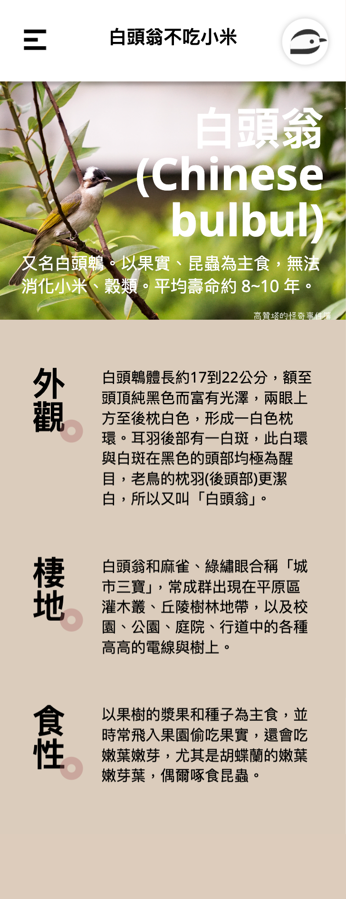

# 三宏科技 TRIDENT HTML & CSS Demo

徵才筆試 HTML & CSS 題

## 任務說明
- [設計稿](https://www.figma.com/file/OtXrcuXF11jaD81p7k3BrO/%E7%AD%86%E8%A9%A6%E9%A1%8C-Public)
- 可使用任意的 HTML / CSS / JavaScript Framework
- Logo 僅限使用 CSS 撰寫
- 需有 RWD，breakpoint 可以自行設定
- 選單的選項要能被選擇，需做出 selected 的效果
- 漢堡選單按鈕只在 mobile 版顯示，預設折疊，並且能折疊/展開選單
- (optional) 可以此設計為基礎，額外添加自己的設計

## 開發紀錄

- 使用 SCSS 撰寫樣式
- LOGO 先使用 [CSS Border Radius Generator](https://10015.io/tools/css-border-radius-generator) 進行描繪，取得 border-radius 數值，再將使用 clip-path 進行裁剪
- Breakpoint 設為 1200px， >= 1200px 為桌機版 Layout，< 1200px 為手機版 Layout

## 優化調整
- banner 圖片壓縮
- 增加 meta description
- 增加 favicon

## 切版畫面截圖

